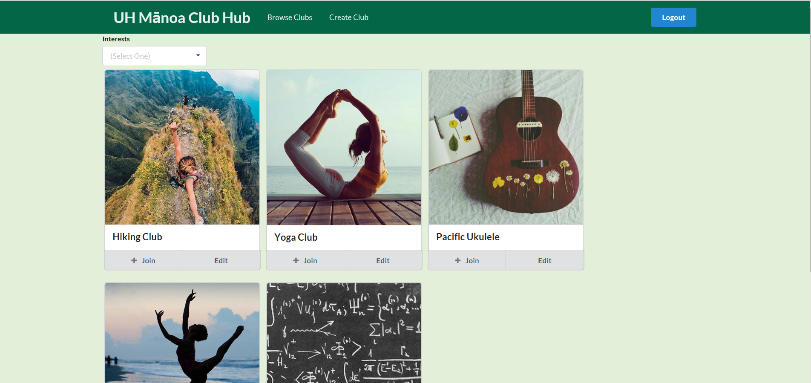

## UH Manoa Club Hub

The UH Manoa Club Hub is the final group project that I helped work on for ICS 314 at UH Manoa for the Spring 2017 semester. The app was created with Meteor, and it is essentially a listing of all clubs at the school which students can browse and join. When a student joins a club, they can go to their home page which will show all the clubs they are a part of and any upcoming events for these clubs. The organization created for this project is located [here.](https://github.com/uhclubhub) The project was created with Meteor and is comprised of both HTML and Javascript, and is a culmination of all the skills we had been learning and refining for the whole semester. 

## My Contributions and Lessons

I worked on various parts of the project, from creating and wiring up the profile page to implementing user authentication that used the UH CAS test server. Since this is one of the few group programming projects that I worked on, I learned quite a bit of lessons. First off, planning and communication could be quite difficult at times. While we did communicate through slack and testing, we never really made any plans with these messages. Only when we sat down and had a physical meeting did we ever accomplish any of our planning goals. This project was also quite tough as one of our members (there was 3 of us total) didn't work on the project at all, which meant that the project ended up being unfinished and harder than it should've been. There were times when I had to rely on this member to finish the specific issue they were working on to complete mine, but since they never did it it complicated things. For the next group project I work on, I'll focus more on communication and meeting our deadlines, as this ended up being our biggest hangups and failings.
